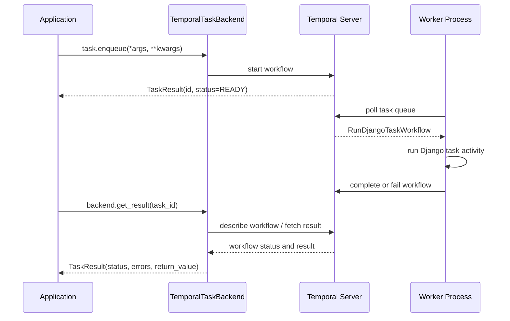

# django-tasks-temporal

[](https://opensource.org/licenses/MIT)

A Temporal task queue backend for Django 6.0's built-in task framework.

## Features

- Full integration with Django 6.0's task framework (`django.tasks`)
- Delayed task execution with scheduled times
- Priority-based task processing
- Crash recovery with automatic task reclaim
- Django Admin integration for task monitoring and management
- HTTP endpoints for external triggers (webhooks, Cloud Scheduler, etc.)

## Architecture



## Requirements

- Python 3.12+
- Django 6.0+

## Installation

```bash
uv add django-tasks-temporal
```

Start a local Temporal server for development:

```bash
docker compose up -d
```

This repository also includes a convenience target:

```bash
just infra-up
```

## Quick Start

1. Add `django_tasks_temporal` to your `INSTALLED_APPS`:

```python
INSTALLED_APPS = [
    # ...
    "django_tasks_temporal",
]
```

2. Configure the task backend in your Django settings:

```python
TASKS = {
    "default": {
        "BACKEND": "django_tasks_temporal.TemporalTaskBackend",
        "QUEUES": [],  # Empty list = allow all queue names
        "OPTIONS": {
            "target_host": "localhost:7233",
            # Temporal connection options (e.g. host, namespace)
        },
    },
}
```

3. Define a task:

```python
from django.tasks import task

@task
def send_email(to: str, subject: str, body: str):
    # Send email logic here
    pass
```

4. Enqueue the task:

```python
result = send_email.enqueue("user@example.com", "Hello", "World")
print(f"Task ID: {result.id}")
```

5. Run the worker:

```bash
python manage.py run_temporal_worker
```

5.a

Alternatively you can start a worker directly without manage.py:
```bash
DJANGO_SETTINGS_MODULE="your-django.settings" python -m django_tasks_temporal.worker
```


## Configuration Options

```python
TASKS = {
    "default": {
        "BACKEND": "django_tasks_temporal.TemporalTaskBackend",
        "QUEUES": [],  # Empty list = allow all queue names
        "OPTIONS": {
            "target_host": "localhost:7233",  # Temporal server address
            "namespace": "default",  # Temporal namespace
            "task_queue": "django-tasks", # Temporal task queue name
            "max_concurrent_workflow_tasks": None,  # Omit or set to None for Temporal defaults
            "max_concurrent_activities": None,  # Omit or set to None for Temporal defaults
        },
    },
}
```

Notes:

- `target_host` is required.
- `namespace` defaults to `"default"` if omitted.
- `task_queue` defaults to `"django-tasks"` if omitted.
- `max_concurrent_workflow_tasks` and `max_concurrent_activities` default to `None`, which lets Temporal use its defaults.

## Management Commands

### run_temporal_worker

Start a worker to process tasks:

```bash
python manage.py run_temporal_worker [--backend BACKEND] [--no-fallback]
```

Options:

- `--backend`: Select the Django task backend from `settings.TASKS`. Defaults to `default`.
- `--no-fallback`: Disable the clean-subprocess retry used when in-process worker startup fails because of an import or sandbox conflict.

You can also run the worker module directly:

```bash
DJANGO_SETTINGS_MODULE="your_django_project.settings" python -m django_tasks_temporal.worker --backend default
```

Available endpoints:

- `POST /tasks/run/` - Process multiple tasks
- `POST /tasks/run-one/` - Process a single task
- `POST /tasks/execute/<task_id>/` - Execute specific task by ID
- `GET /tasks/status/<task_id>/` - Get task status
- `POST /tasks/purge/` - Purge completed tasks

## Public API

- `django_tasks_temporal.TemporalTaskBackend`: Django task backend implementation for Temporal.
- `python manage.py run_temporal_worker`: Management command for running a Temporal worker.
- `python -m django_tasks_temporal.worker`: Module entrypoint for running a worker directly.

## Development

Run checks and tests locally:

```bash
just test
just lint
```

## License

MIT License
