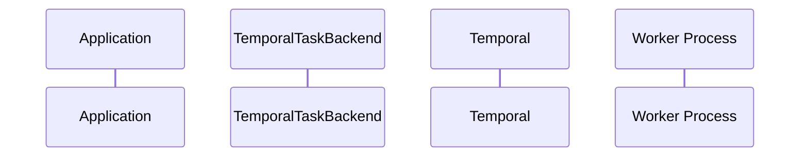

# django-tasks-temporal

[](https://opensource.org/licenses/MIT)

A Temporal task queue backend for Django 6.0's built-in task framework.

## Features

- Full integration with Django 6.0's task framework (`django.tasks`)
- Delayed task execution with scheduled times
- Priority-based task processing
- Crash recovery with automatic task reclaim
- Django Admin integration for task monitoring and management
- HTTP endpoints for external triggers (webhooks, Cloud Scheduler, etc.)

## Architecture

[//]: # (TODO: Add architecture diagram)


## Requirements

- Python 3.12+
- Django 6.0+

## Installation

```bash
uv add django-tasks-temporal
```

## Quick Start

1. Add `django_tasks_temporal` to your `INSTALLED_APPS`:

```python
INSTALLED_APPS = [
    # ...
    "django_tasks_temporal",
]
```

2. Configure the task backend in your Django settings:

```python
TASKS = {
    "default": {
        "BACKEND": "django_tasks_temporal.TemporalTaskBackend",
        "QUEUES": [],  # Empty list = allow all queue names
        "OPTIONS": {
            "target_host": "localhost:7233",
            # Temporal connection options (e.g. host, namespace)
        },
    },
}
```

3. Define a task:

```python
from django.tasks import task

@task
def send_email(to: str, subject: str, body: str):
    # Send email logic here
    pass
```

4. Enqueue the task:

```python
result = send_email.enqueue("user@example.com", "Hello", "World")
print(f"Task ID: {result.id}")
```

5. Run the worker:

```bash
python manage.py run_temporal_tasks
```

5.a

Alternatively you can start a worker directly without manage.py:
```bash
DJANGO_SETTINGS_MODULE="your-django.settings" python -m django_tasks_temporal.worker
```


## Configuration Options

```python
TASKS = {
    "default": {
        "BACKEND": "django_tasks_templral.TemporalTaskBackend",
        "QUEUES": [],  # Empty list = allow all queue names
        "OPTIONS": {
            "target_host": "localhost:7233",  # Temporal server address
            "namespace": "default",  # Temporal namespace
            "task_queue": "django-tasks", # Temporal task queue name
            "max_concurrent_workflow_tasks": 0,  # Max concurrent workflow tasks (0 = unlimited)
            "max_concurrent_activities": 0,  # Max concurrent activity tasks (0 = unlimited)
        },
    },
}
```

## Management Commands

### run_temporal_tasks

Start a worker to process tasks:


[//]: # (TODO: add options documentation)
```bash
python manage.py run_temporal_tasks [options]

```

## Django Admin

The package provides Django Admin integration for viewing and managing tasks:

- View task list with status, priority, queue
- Filter by status, queue, backend
- Run selected tasks
- Retry failed tasks

## HTTP Endpoints

Include the URLs in your project:

```python
from django.urls import include, path

urlpatterns = [
    # ...
    path("tasks/", include("django_tasks_temporal.urls")),
]
```

Available endpoints:

- `POST /tasks/run/` - Process multiple tasks
- `POST /tasks/run-one/` - Process a single task
- `POST /tasks/execute/<task_id>/` - Execute specific task by ID
- `GET /tasks/status/<task_id>/` - Get task status
- `POST /tasks/purge/` - Purge completed tasks

## Public API


## License

MIT License